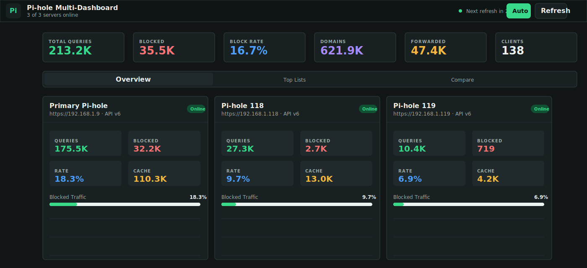
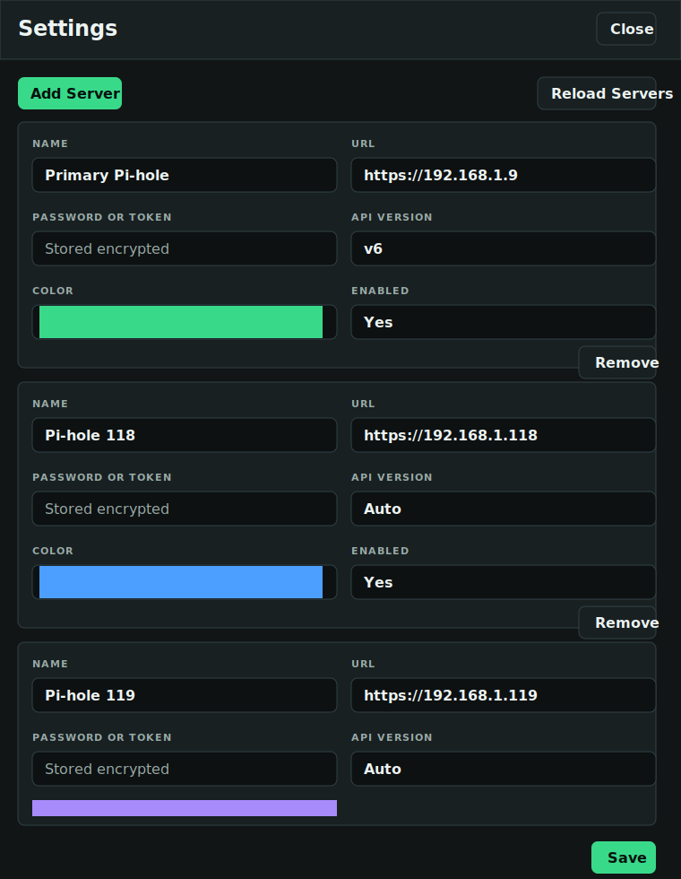

# Pi-hole Multi-Dashboard

A small Dockerized dashboard for multiple Pi-hole servers. It shows aggregate metrics across all configured servers plus individual server cards, top lists, and comparisons.

The backend proxies Pi-hole API calls so the browser avoids CORS issues. It tries the Pi-hole v6 REST API first, then falls back to the v5 `admin/api.php` API when `version` is set to `auto`.

## Screenshots

### Overview



### Server Settings



## Run

Create a local `.env` file for secrets and deployment-specific settings:

```bash
cp .env.example .env
```

Then edit `.env` and start the app:

```bash
docker compose up --build
```

Open `http://localhost:8080` or `https://localhost:8443`.

The app stores server settings in SQLite at `/data/pidash.sqlite`. `config/piholes.json` is optional and only used to seed an empty database when `PIHOLE_CONFIG` is set.

## Configure

Use the Settings UI to add Pi-hole servers. For Pi-hole v6, use the web/app password. For Pi-hole v5, use the API token. Server records are stored in SQLite, and passwords are encrypted before they are written.

Set `CONFIG_ENCRYPTION_KEY` in `.env` before saving Pi-hole passwords:

```dotenv
CONFIG_ENCRYPTION_KEY=use-a-long-random-secret
```

Generate a good key with:

```bash
openssl rand -base64 32
```

The browser never receives stored passwords. It only receives `hasPassword: true` for saved credentials.

## Dashboard Authentication

Authentication is controlled by `AUTH_MODE` in `.env`.

### Basic Auth

Basic Auth is the default mode. Set a strong `DASHBOARD_PASSWORD` to protect both the UI and `/api/*` endpoints:

```dotenv
AUTH_MODE=basic
DASHBOARD_USERNAME=admin
DASHBOARD_PASSWORD=use-a-long-random-password
```

If `AUTH_MODE=basic` and `DASHBOARD_PASSWORD` is empty, the dashboard will reject requests until you configure a password. Set `AUTH_MODE=none` only for a trusted, isolated local deployment.

### Reverse Proxy / IdP Auth

Use `AUTH_MODE=proxy` when an identity-aware reverse proxy handles authentication in front of the app. This works with Authentik, Authelia, Keycloak, and similar systems when they inject trusted identity headers.

```dotenv
AUTH_MODE=proxy
AUTH_PROXY_USER_HEADER=x-forwarded-user
AUTH_PROXY_EMAIL_HEADER=x-forwarded-email
AUTH_PROXY_NAME_HEADER=x-forwarded-name
```

Only use proxy mode when the dashboard is not directly reachable by users. The reverse proxy must strip incoming client-supplied identity headers before adding its own.

Common header examples:

```dotenv
# Authentik forward auth commonly uses these:
AUTH_PROXY_USER_HEADER=x-authentik-username
AUTH_PROXY_EMAIL_HEADER=x-authentik-email
AUTH_PROXY_NAME_HEADER=x-authentik-name
```

```dotenv
# Authelia commonly uses Remote-User style headers:
AUTH_PROXY_USER_HEADER=remote-user
AUTH_PROXY_EMAIL_HEADER=remote-email
AUTH_PROXY_NAME_HEADER=remote-name
```

```dotenv
# Keycloak is commonly placed behind oauth2-proxy or a gateway:
AUTH_PROXY_USER_HEADER=x-forwarded-user
AUTH_PROXY_EMAIL_HEADER=x-forwarded-email
AUTH_PROXY_NAME_HEADER=x-forwarded-preferred-username
```

Use the same scheme that the Pi-hole API accepts from this container. For many LAN installs, `http://192.168.x.x` works even when the admin UI is usually opened as `https://192.168.x.x/admin/`.

If you use HTTPS with a self-signed Pi-hole certificate, Node will reject it unless you set this in `.env`:

```dotenv
NODE_TLS_REJECT_UNAUTHORIZED=0
```

Leave it unset for the safer default when Pi-hole uses trusted certificates or HTTP.

## Example `.env`

```dotenv
# Required before storing Pi-hole passwords in SQLite.
# Generate with: openssl rand -base64 32
CONFIG_ENCRYPTION_KEY=

# Optional but recommended. Enables Basic Auth for the dashboard UI and API.
AUTH_MODE=basic
DASHBOARD_USERNAME=admin
DASHBOARD_PASSWORD=

# Optional. Use when Authentik, Authelia, Keycloak, or another IdP protects
# the app through a reverse proxy that injects trusted identity headers.
# AUTH_MODE=proxy
# AUTH_PROXY_USER_HEADER=x-forwarded-user
# AUTH_PROXY_EMAIL_HEADER=x-forwarded-email
# AUTH_PROXY_NAME_HEADER=x-forwarded-name

# Optional. Set to 0 only when polling Pi-hole HTTPS endpoints with self-signed certs.
NODE_TLS_REJECT_UNAUTHORIZED=1
```

Keep `.env` private. It is ignored by Git.

## Dashboard HTTPS

The dashboard can serve HTTPS with an automatically generated self-signed certificate. The included `docker-compose.yml` enables this with:

```yaml
ports:
  - "8080:8080"
  - "8443:8443"
environment:
  ENABLE_HTTPS: "true"
  HTTPS_PORT: 8443
```

Open `https://localhost:8443` and accept the browser warning for the self-signed certificate.

To use your own certificate, mount files into the container and set:

```yaml
environment:
  TLS_CERT_FILE: /certs/fullchain.pem
  TLS_KEY_FILE: /certs/privkey.pem
volumes:
  - ./certs:/certs:ro
```

## Optional JSON Seed

To seed a fresh SQLite database from a JSON file, copy and edit the example, then mount it and set `PIHOLE_CONFIG`:

```bash
cp config/piholes.example.json config/piholes.json
```

```yaml
environment:
  PIHOLE_CONFIG: /app/config/piholes.json
volumes:
  - ./config/piholes.json:/app/config/piholes.json:ro
```

The seed only runs when the SQLite database has no server records.

## Quality of Life

### First Run Checklist

1. Create `.env` from `.env.example`.
2. Set `CONFIG_ENCRYPTION_KEY` before saving Pi-hole passwords.
3. Set `DASHBOARD_PASSWORD` or place the app behind a trusted IdP/reverse proxy.
4. Start the app with `docker compose up --build`.
5. Open Settings, add Pi-hole servers, then save.

### Back Up Server Settings

Server records are stored in the Docker volume at `/data/pidash.sqlite`. To back up the named Compose volume:

```bash
docker run --rm \
  -v pidash_pidash-data:/data:ro \
  -v "$PWD":/backup \
  alpine sh -c 'cp /data/pidash.sqlite /backup/pidash.sqlite.backup'
```

Restore by stopping the app, copying the backup into the volume, then starting the app again.

### Update the App

```bash
git pull
docker compose up --build -d
```

The SQLite volume is preserved across container rebuilds.

### Health Check

Use `/healthz` for uptime checks:

```bash
curl http://localhost:8080/healthz
```

It returns:

```json
{"ok":true}
```

### Troubleshooting

- If Settings refuses to save a password, confirm `CONFIG_ENCRYPTION_KEY` is set and the container was recreated after editing `.env`.
- If a Pi-hole shows offline over HTTPS with a self-signed certificate, set `NODE_TLS_REJECT_UNAUTHORIZED=0` in `.env` or use a trusted certificate.
- If existing encrypted passwords stop working, verify `CONFIG_ENCRYPTION_KEY` has not changed. Saved passwords cannot be decrypted with a different key.
- If the dashboard loads but has no servers, open Settings and add servers, or seed a fresh database with `PIHOLE_CONFIG`.
